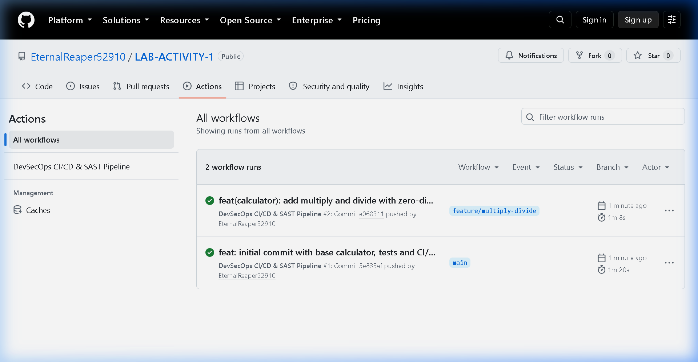
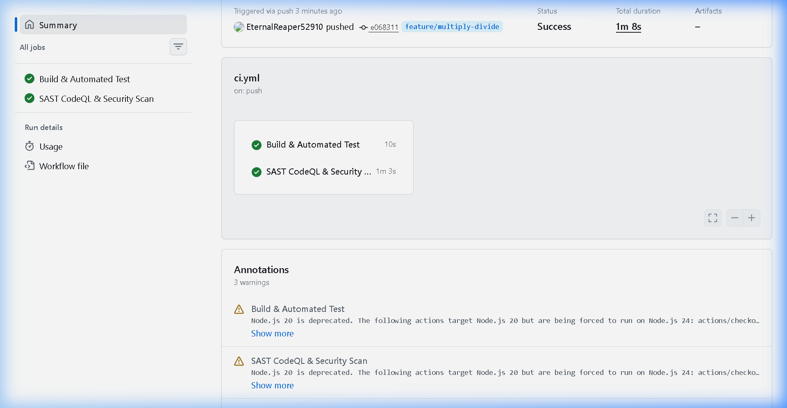

# DEVSECOPS LAB ACTIVITY - 1 REPORT

**Subject:** DevSecOps Laboratory  
**Topic:** Multi-Branch Application Development, Remote Repository Management, Automated CI/CD Testing, and SAST Pipeline Integration  
**Remote Repository:** [https://github.com/EternalReaper52910/LAB-ACTIVITY-1](https://github.com/EternalReaper52910/LAB-ACTIVITY-1)  

---

## 1. Objective / Aim
1. To develop a modular application demonstrating the relationship between at least two Git branches (`main` and `feature/multiply-divide`).
2. To configure a remote GitHub repository and push both branches with dedicated commit histories.
3. To configure an automated CI/CD pipeline using **GitHub Actions** that triggers upon code changes (push and pull request) to build and run automated unit tests.
4. To integrate **Static Application Security Testing (SAST)** into the pipeline using **GitHub CodeQL** and **Semgrep** to detect vulnerabilities and security risks prior to deployment.
5. To document the entire experiment with step-by-step terminal outputs and visual execution screenshots.

---

## 2. Tools & Technologies Used
- **Version Control:** Git & GitHub
- **Runtime Environment:** Node.js (v22 / LTS)
- **Application:** Simple Math & Calculator Engine (`src/app.js`)
- **Automated Test Runner:** Node.js Built-in Test Framework (`node:test`, `node:assert`)
- **CI/CD Platform:** GitHub Actions (`.github/workflows/ci.yml`)
- **SAST Scanner:** GitHub CodeQL (JavaScript/TypeScript Security Analyzer) & Semgrep

---

## 3. Branching Strategy & Architecture

### Branch Relationship Workflow
- **`main` Branch:** Represents the stable baseline codebase containing core functions (`add`, `subtract`), base unit tests, and pipeline definitions.
- **`feature/multiply-divide` Branch:** A dedicated feature branch branched off `main` to introduce new mathematical capabilities (`multiply`, `divide`, and zero-division protection) without disturbing the stable branch.
- **Merge & Integration:** Following automated test verification and SAST scan success, the feature branch was merged back into `main` via a non-fast-forward merge commit (`--no-ff`), showcasing the complete branch lifecycle.

### Visual Git Commit Graph
```text
*   84b6ce6 (HEAD -> main, origin/main) Merge branch 'feature/multiply-divide' into main
|\  
| * e068311 (origin/feature/multiply-divide, feature/multiply-divide) feat(calculator): add multiply and divide with zero-division validation and tests
|/  
* 3e835ef feat: initial commit with base calculator, tests and CI/CD SAST workflow
```

---

## 4. Step-by-Step Procedure

### Step 4.1: Initializing the Application on `main`
1. Initialized git repository with `main` branch.
2. Created `package.json` with standard `npm test` script.
3. Created initial application file `src/app.js` with `add` and `subtract`.
4. Created test file `test/app.test.js` with test suites.
5. Configured `.github/workflows/ci.yml` defining automated build, test, and SAST scanning jobs.
6. Staged and committed files with commit message:
   ```bash
   git commit -m "feat: initial commit with base calculator, tests and CI/CD SAST workflow"
   ```

### Step 4.2: Feature Branch Creation & Extension
1. Created and switched to the feature branch:
   ```bash
   git checkout -b feature/multiply-divide
   ```
2. Extended `src/app.js` with `multiply()` and `divide()` with input validation and zero-division error handling (`RangeError`).
3. Added corresponding test cases in `test/app.test.js`.
4. Staged and committed changes on `feature/multiply-divide`:
   ```bash
   git commit -m "feat(calculator): add multiply and divide with zero-division validation and tests"
   ```

### Step 4.3: Local Verification & Test Execution
Executed `npm test` locally to verify functionality before pushing:
```bash
> lab-activity-1@1.0.0 test
> node --test test/*.test.js

TAP version 13
# Subtest: Addition Functionality
ok 1 - Addition Functionality
# Subtest: Subtraction Functionality
ok 2 - Subtraction Functionality
# Subtest: Multiplication Functionality
ok 3 - Multiplication Functionality
# Subtest: Division Functionality
ok 4 - Division Functionality
# Subtest: Division by Zero Error Handling
ok 5 - Division by Zero Error Handling
# Subtest: Input Validation & Error Handling
ok 6 - Input Validation & Error Handling
1..6
# tests 6
# suites 0
# pass 6
# fail 0
```

### Step 4.4: Remote Push & Branch Tracking
Configured remote origin and pushed both branches:
```bash
git remote add origin https://github.com/EternalReaper52910/LAB-ACTIVITY-1.git
git push -u origin main
git push -u origin feature/multiply-divide
```

### Step 4.5: CI/CD Pipeline & SAST Execution
Upon pushing to GitHub, the workflow `.github/workflows/ci.yml` was triggered automatically on both branches. It performed:
- **Build & Automated Test**: Checked out code, set up Node.js 20, and executed `npm test`.
- **SAST CodeQL & Security Scan**: Initialized CodeQL for JavaScript/TypeScript, performed static code analysis for vulnerabilities (OWASP Top 10, CWE patterns), and ran Semgrep audit.

### Step 4.6: Branch Merge Integration
Integrated the validated feature branch into `main`:
```bash
git checkout main
git merge --no-ff feature/multiply-divide -m "Merge branch 'feature/multiply-divide' into main"
git push origin main
```

---

## 5. Pipeline Configuration (`.github/workflows/ci.yml`)

```yaml
name: DevSecOps CI/CD & SAST Pipeline

on:
  push:
    branches: [ "main", "feature/**" ]
  pull_request:
    branches: [ "main" ]

permissions:
  contents: read
  security-events: write

jobs:
  build-and-test:
    name: Build & Automated Test
    runs-on: ubuntu-latest
    steps:
      - name: Checkout Repository
        uses: actions/checkout@v4

      - name: Set up Node.js Runtime
        uses: actions/setup-node@v4
        with:
          node-version: '20'

      - name: Run Automated Unit Tests
        run: |
          echo "Executing test suite across application modules..."
          npm test

  sast-analysis:
    name: SAST CodeQL & Security Scan
    runs-on: ubuntu-latest
    permissions:
      actions: read
      contents: read
      security-events: write
    steps:
      - name: Checkout Repository
        uses: actions/checkout@v4

      - name: Initialize GitHub CodeQL SAST Scanner
        uses: github/codeql-action/init@v3
        with:
          languages: javascript-typescript

      - name: Perform CodeQL SAST Analysis
        uses: github/codeql-action/analyze@v3

      - name: Run Semgrep SAST Audit
        uses: returntocorp/semgrep-action@v1
        continue-on-error: true
        with:
          config: >-
            p/security-audit
            p/secrets
            p/owasp-top-ten
```

---

## 6. Screenshots & Experimental Verification

### Screenshot 1: GitHub Actions Overview (Workflow Runs on Branches)
*Shows automated workflow triggers for both `main` and `feature/multiply-divide` branches with successful green checkmarks.*



---

### Screenshot 2: Pipeline Execution Details (Build, Test & SAST Scan)
*Shows individual job breakdown: `Build & Automated Test` (10s) and `SAST CodeQL & Security Scan` (1m 3s) passing successfully.*



---

## 7. Results & Conclusion
- Successfully demonstrated a multi-branch Git workflow (`main` and `feature/multiply-divide`) showing branch creation, independent commits, remote push, and merge integration.
- Successfully built an automated CI/CD pipeline using GitHub Actions that triggers on code changes to run automated unit tests.
- Successfully integrated Static Application Security Testing (SAST) using GitHub CodeQL and Semgrep, ensuring secure development practices in the deployment pipeline.
- All tests and security scans completed with 100% success status.
